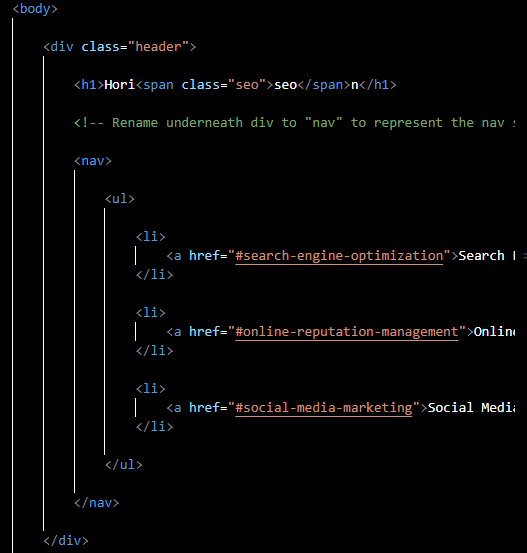
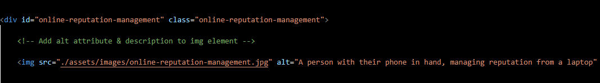
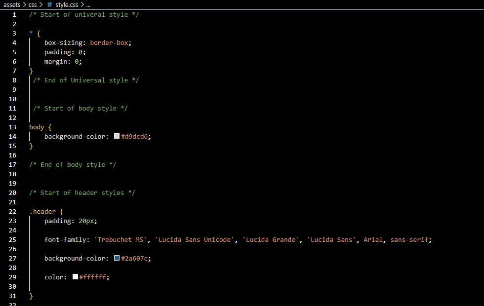

# Horiseon Code Refactor 

This Horiseon code refactor is to declutter css, make sure internal links work properly, 
make sure elements follow logical structure, make accessible alt attributes when viewing 
image elements, create a descriptive title for the title element, make the html easier to read, and make sure my heading 
attributes fall in sequential order.

## What changes will be made?

* Create adequate spacing between html & stylesheet elements so they can be easily read
* In the heading, put "meta charset= utf-8" first, the title second, and the stylesheet link 3rd
* Update the first "div" in the body section to "nav" to represent the navigation menu.
* Add id for search engine to link to nav menu
* Add alt tags to all img's in the content section with adequate descriptions 
* Add alt tags with no description to decorative img's 
* Structure stylesheet in a more constructive & organized way
* Change div element in stylesheet to nav to account for html change 
* Create a descriptive README file that clearly explains updates to internal code

## What does this solve?

* This code refactor restructures the html and stylesheet to be read easier and to remove repeated styles and combine them into one. 
* Enables all images to be explained to assistive technology, screen reader, and search engines. (alt attributes are accessible)
* "Search engine optimization" nav link is now available for use. 

## Examples of changes

## Link to application

[Horiseon](https://gestan24.github.io/urban-octo-telegram/)